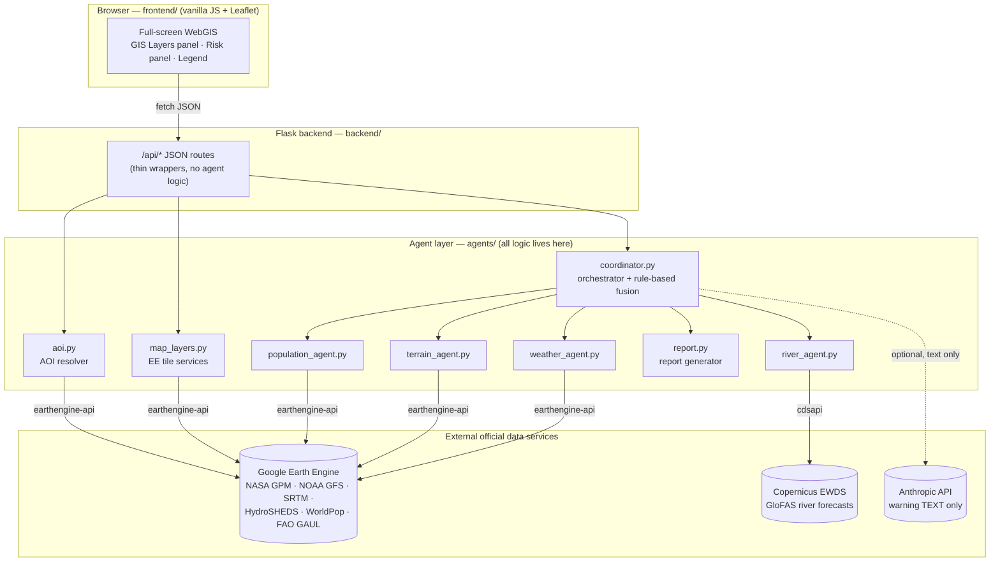
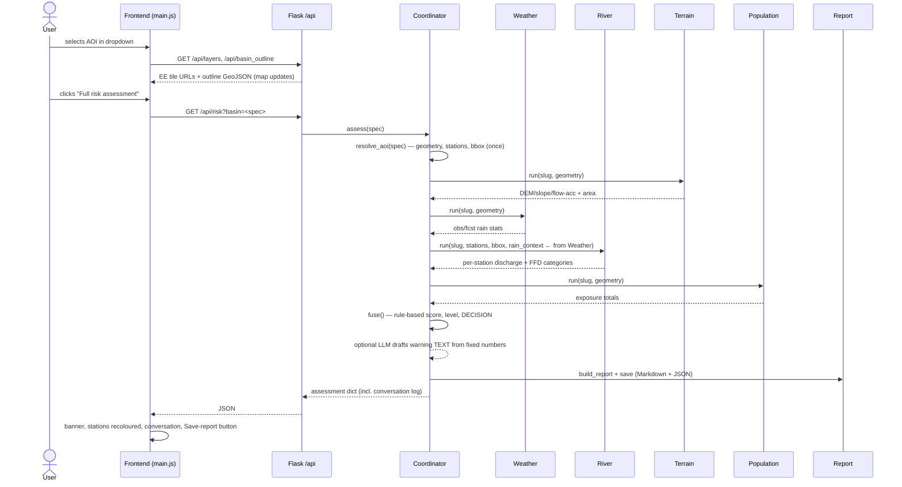

# NDMA Flood Early-Warning Prototype — System Architecture

*Multi-agent flood early-warning system for NDMA Pakistan, built entirely on
free/open official data sources.*

> Diagrams are in Mermaid. VS Code renders them in Markdown Preview
> (Ctrl+Shift+V); to make a PDF, install the "Markdown PDF" extension and
> right-click → *Markdown PDF: Export (pdf)*.

---

## 1. Overall architecture



Also present, sharing the same agents: `webapp/app.py` (Streamlit) — internal
iteration UI only, never demoed externally. **Rule: agent logic exists once,
in `agents/`; both frontends only call it.**

## 2. The agents — responsibilities, inputs, outputs

| Agent | Input | Data source (official) | Output (JSON) |
|---|---|---|---|
| **Terrain** | AOI geometry, cache slug | SRTM 30 m DEM (USGS/NASA), HydroSHEDS flow accumulation — static | GeoTIFF paths (DEM/slope/flow-acc), AOI area km² |
| **Weather** | AOI geometry, cache slug | **Observed:** NASA GPM IMERG V07 (~11 km, 30-min cadence, 1–3 day latency). **Forecast:** NOAA GFS 0.25° (4 runs/day) | obs 24 h/72 h and fcst 72 h rain (AOI mean+max, mm), data latency, window end |
| **River** | AOI stations + bbox, weather's rain context | Copernicus GloFAS operational forecast (LISFLOOD, 0.05°, daily cycle) via cdsapi | Per-station discharge (+24…+120 h), FFD flood category per station, worst station |
| **Population** | AOI geometry, cache slug | WorldPop 100 m, 2020 | total population, floodplain population (slope < 2° proxy) |
| **Coordinator** | AOI spec string | (none — consumes agent outputs) | risk score 0–100, risk level, decision, conversation log, report |
| **Report** | full assessment dict | (none) | Markdown sitrep + JSON archive in `data/reports/` |

**None of the four data agents uses an LLM.** They are deterministic
geospatial programs. The **only** LLM call in the whole system is the optional
warning-text drafting step (Anthropic `claude-opus-4-8`), and it is
constrained to *rewording* numbers that were already computed (see §6).

## 3. AOI selection — how it propagates

`agents/aoi.py` accepts three spec forms and returns one normalized dict:

```
"chenab"              → registered river basin (agents/basins.py)
"province:Punjab"     → GAUL level-1 unit inside Pakistan
"district:Multan"     → GAUL level-2 unit inside Pakistan

resolve_aoi(spec) → { kind, spec, slug, name,
                      geometry (ee.Geometry),        ← every EE agent uses this
                      stations (FFD stations inside),← river agent uses this
                      bbox [N,W,S,E] }               ← GloFAS download window
```

- Basins resolve with **zero** server round-trips (geometry built lazily).
- Admin units cost **one** batched `getInfo` (bounds + station membership).
- Stations for an admin unit = whichever registered FFD stations physically
  fall inside its polygon; a unit with no station runs in degraded mode
  (river component dropped, weights renormalised — never faked).
- The frontend sends the same spec string as `?basin=` on every endpoint, so
  one dropdown selection drives layers, outline, all pipelines and the risk run.

## 4. Sequence — from AOI selection to final report



Every hand-off above is logged as a message in `assessment["conversation"]` —
generated by rules from the real numbers, so the inter-agent traffic is fully
auditable in the UI ("Agent conversation") and in the saved JSON.

## 5. Risk fusion — rule-based, no AI in the loop

```
components:
  river          = FFD category of worst station → {normal 0 … exceptional 100}
  rain_forecast  = GFS 72 h AOI-mean mm → steps (25,20)(35,40)(50,60)(70,80)(90,100)
  rain_observed  = GPM 72 h AOI-mean mm → same steps

score = Σ weightᵢ·componentᵢ / Σ weightᵢ      weights: river .5, fcst .3, obs .2
        (failed agents dropped; remaining weights renormalised; "degraded"
         flag + failed agent names always reported)

level:    <20 low | <40 moderate | <60 high | ≥60 severe
decision: low→routine_monitoring, moderate→advisory, high→alert,
          severe→warning, no data→manual_review
```

The rain steps are **calibrated from backtests** (`scripts/backtest_rain.py`)
on the Chenab: 2010 superflood ≈100 mm basin-mean, 2022 floods ≈51 mm, 2018
non-flood monsoon ≈34 mm. Basin-**max** was rejected as an input because a
single foothill pixel exceeds 200 mm in any ordinary monsoon.
The discharge backtest (`scripts/backtest_discharge.py`) ranks 2010>2022≈2018
correctly but found GloFAS ≈2× LOW vs FFD-reported cusecs — documented as an
under-warn caveat in every report (see Limitations).

`fuse()` is a pure function with unit tests (`tests/test_agents.py`).

## 6. Where the LLM is (and is not)

| Step | LLM? | Model | Why |
|---|---|---|---|
| Data acquisition (4 agents) | **No** | — | numbers must be measurements |
| Risk score / level / decision | **No** | — | must be reproducible + auditable |
| Agent conversation log | **No** | — | rule-generated from real numbers |
| Situation report | **No** | — | template over computed values |
| Public warning **text** | Optional | Anthropic `claude-opus-4-8` | plain-language wording only |

The single LLM prompt (in `coordinator._draft_warning`) is:

> *System:* "You draft short public flood warnings for NDMA Pakistan. Use ONLY
> the numbers and the recommended action given — never invent, change, or
> recompute any figure or escalate/downgrade the action. Plain language, max
> 120 words, include the advisory that this is an automated prototype."
> *User:* the fixed facts as JSON (AOI, score, level, decision, components,
> exposure).

If the API is unreachable or the key missing, a deterministic template string
is used instead — the assessment never fails because of the LLM, and the LLM
can never alter a number (it only ever sees final values, and its output goes
into a clearly-labelled "Draft public warning" field).

## 7. HTTP API

| Endpoint | Method | Purpose | Example |
|---|---|---|---|
| `/api/health` | GET | liveness | `{"status":"ok"}` |
| `/api/basins` | GET | basin registry + station coords | `[{"key":"chenab","name":"Chenab","stations":[{"name":"Marala","lon":74.46,"lat":32.67},…]}]` |
| `/api/admin_units` | GET | Pakistan provinces + districts (GAUL) | `{"provinces":[{"name":"Punjab","province":"Punjab"}],"districts":[…]}` |
| `/api/layers?basin=` | GET | EE tile layer defs, grouped by agent | `[{"id":"rain72","url":"https://earthengine…/{z}/{x}/{y}","legend":{…}}]` |
| `/api/basin_outline?basin=` | GET | AOI polygon (simplified GeoJSON) | GeometryCollection of polygons |
| `/api/weather_admin?basin=&level=` | GET | per-province/district rain choropleth | GeoJSON FC; props `name, province, obs72_mm, fcst72_mm` |
| `/api/pipeline/<name>?basin=` | GET | run ONE pipeline: `weather · disaster/river · terrain · population · risk` | agent JSON (see §2) |
| `/api/risk?basin=` | GET | full multi-agent assessment | assessment dict incl. `conversation`, `report_path` |
| `/api/report` | GET | latest report (Markdown) | text/markdown |
| `/api/reports` | GET | report history | `[{"name":"sitrep_chenab_20260708_120000.md","json_name":…,"size_kb":3.1,…}]` |
| `/api/reports/<name>` | GET | one saved report (md or json) | file content |
| `/api/save_report` | POST | save the displayed assessment without re-running | `{"saved":true,"markdown_path":"…","json_path":"…"}` |

`?basin=` always accepts `chenab`-style keys or `province:Punjab` /
`district:Multan` specs. Errors return JSON with an `error` field and proper
status codes (400 unknown AOI, 404 unknown pipeline/report, 500 with the agent
error surfaced).

## 8. Data flow & storage ("database schema")

There is deliberately **no database** in the prototype — state is files,
which makes every artefact inspectable and the system trivially portable:

```
data/
├─ raw/         glofas_forecast_<slug>_<YYYYMMDD>.nc   GloFAS NetCDF per AOI per forecast date
├─ processed/   <slug>_dem.tif · <slug>_slope.tif · <slug>_flow_acc.tif
│               population_<slug>.json                  cached exposure totals
│               backtest CSVs (rain/discharge)
└─ reports/     sitrep_<slug>_<YYYYMMDD_HHMMSS>.md/.json  full report history
```

A production deployment would swap `data/` for PostGIS (vector + station time
series) and object storage (rasters, reports) — the agent interfaces don't
change.

## 9. Caching strategy (what is cached and why it is safe)

| Cache | Location | TTL / invalidation | Why safe |
|---|---|---|---|
| Terrain GeoTIFFs | `data/processed/` | forever (delete file to refresh) | SRTM/HydroSHEDS are static datasets |
| Population totals | `data/processed/population_*.json` | forever (delete to refresh) | WorldPop 2020 is a fixed census raster |
| GloFAS NetCDF | `data/raw/` | keyed by forecast **date** | a given day's forecast never changes |
| EE tile URLs | in-process, `map_layers._CACHE` | 2 h (URLs expire ~4 h) | caches URLs, not data |
| Admin rain choropleth | in-process, routes `_ADMIN_CACHE` | 30 min | IMERG only updates every few hours |
| Admin unit name list | in-process, `aoi._UNITS_CACHE` | process lifetime | GAUL 2015 is static |
| **Live rain/discharge stats** | **never cached** | — | recomputed on every run |

Nothing time-sensitive is ever served stale beyond its physical update rate,
and every cache is either keyed by date or holds static data.

## 10. Error handling & degraded mode

- Each agent runs inside `run_safe()` in the coordinator: an exception becomes
  `{"status":"error","error":…}`, is announced in the conversation log, and
  the assessment continues.
- `fuse()` drops failed components and **renormalises the remaining weights**;
  the result carries `degraded: true` + `failed_agents` — shown in the UI
  banner and printed as a bold caveat in the report. With no usable data the
  decision is `manual_review`, never a guessed number.
- GloFAS publish lag → automatic fallback to yesterday's cycle; missing CEMS
  licence → explicit hint in the error.
- IMERG latency → windows anchor to the newest image and the latency (hours)
  is reported rather than silently serving old data as current.
- LLM failure → deterministic template text (assessment unaffected).
- Flask serves agent exceptions as JSON 500s; the dev-server reloader is
  disabled (`use_reloader=False`) because it killed multi-minute pipeline
  requests mid-flight.

## 11. Performance decisions

- **Batched Earth Engine calls**: each agent does at most 1–2 `getInfo`
  round-trips (combined reducers via `ee.Dictionary`); admin choropleths are
  one `reduceRegions` for all units.
- Reducers run at native dataset scale (11 km IMERG, 27.75 km GFS, 100 m
  WorldPop with `tileScale=16`) — finer wastes quota, coarser loses signal.
- Large rasters download via `geemap.download_ee_image` (tiled, bypasses the
  50 MB direct-download cap).
- Frontend: choropleths lazy-load on first enable; obs/fcst variants share one
  fetch; station markers are plain circle markers.
- Typical timings (measured): cached basin risk ≈25 s; first run on a new
  district ≈1–2 min; first run on a large province (terrain download) can be
  ≈8 min — hence per-pipeline buttons so the demo never has to wait on
  terrain.

## 12. Logging & monitoring

- Every assessment's full provenance is the saved JSON (agent outputs +
  conversation + decision) — this *is* the audit log.
- Flask access log on the console; agent progress printed with `[terrain]`-
  style prefixes.
- `/api/health` for liveness; the UI shows backend status in the status bar.
- Production path: rotate JSON assessments into object storage and ship
  console logs to any standard aggregator; no code changes needed in agents.

## 13. Folder structure

```
ndma-flood-warning/
├─ agents/            ALL analysis logic (the only place it exists)
│  ├─ basins.py         AOI registry: 5 basins, stations, FFD cusec bands
│  ├─ aoi.py            AOI resolver (basin | province | district)
│  ├─ ee_common.py      EE auth (service account) + PROJ_LIB fix
│  ├─ terrain_agent.py  SRTM/HydroSHEDS static layers
│  ├─ weather_agent.py  GPM observed + GFS forecast rain (+ admin breakdown)
│  ├─ river_agent.py    GloFAS discharge + FFD classification
│  ├─ population_agent.py WorldPop exposure
│  ├─ coordinator.py    orchestration, message log, rule-based fusion, decision
│  ├─ report.py         Markdown+JSON situation reports + history
│  └─ map_layers.py     EE tile URLs for the WebGIS (presentation only)
├─ backend/           Flask app + /api blueprint (thin, no logic)
├─ frontend/          vanilla JS + Leaflet WebGIS (hardened UI)
├─ webapp/            Streamlit (internal iteration only)
├─ scripts/           backtests (rain 2010/2022/2018, discharge)
├─ tests/             offline unit tests (fusion, classification, report)
├─ data/              raw/ · processed/ · reports/   (gitignored)
├─ credentials/       EE service-account key, cdsapi key (gitignored)
└─ docs/              this file + PRESENTATION_QA.md
```

## 14. Known limitations (stated, not hidden)

1. **GloFAS ≈2× low** vs FFD-reported flows at these stations (2010/2022
   backtest) → categories are conservative; bias correction or GloFAS
   return-period thresholds are the planned fix before operational use.
2. **FFD cusec bands** for non-Chenab rivers are approximations pending manual
   verification against ffd.pmd.gov.pk (page blocks automated fetch).
3. **Floodplain population** uses a slope<2° proxy, not mapped inundation —
   Sentinel-1 SAR inundation mapping is the planned replacement.
4. **Basin polygons** (HydroBASINS level-6 union) run ~30% larger than true
   catchments.
5. **No flash-flood / coastal / urban-drainage capability** — GloFAS covers
   major-river discharge only.
6. Rain-score steps calibrated on the Chenab only; per-basin recalibration
   pending.
7. IMERG observed rain lags 1–3 days (latency always displayed).
8. WorldPop exposure is a 2020 baseline.
